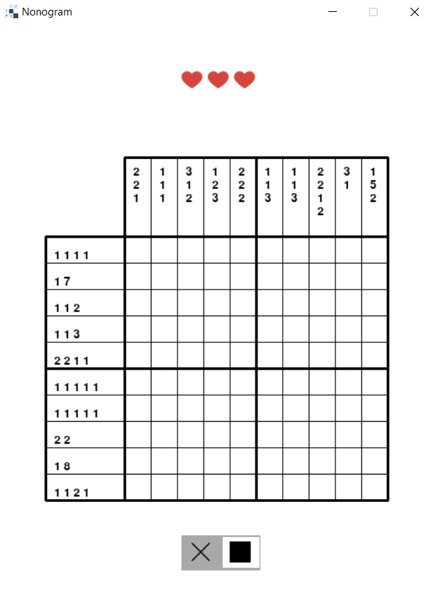
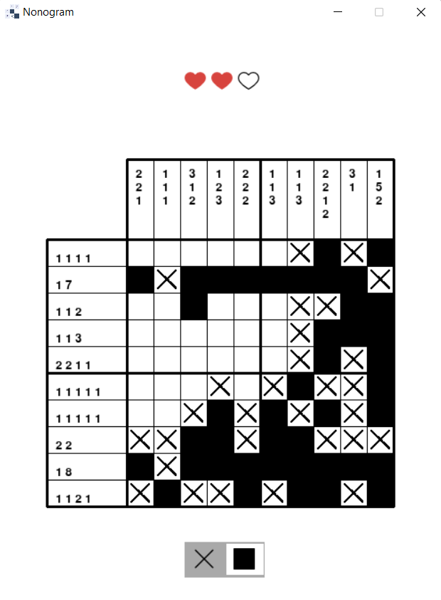
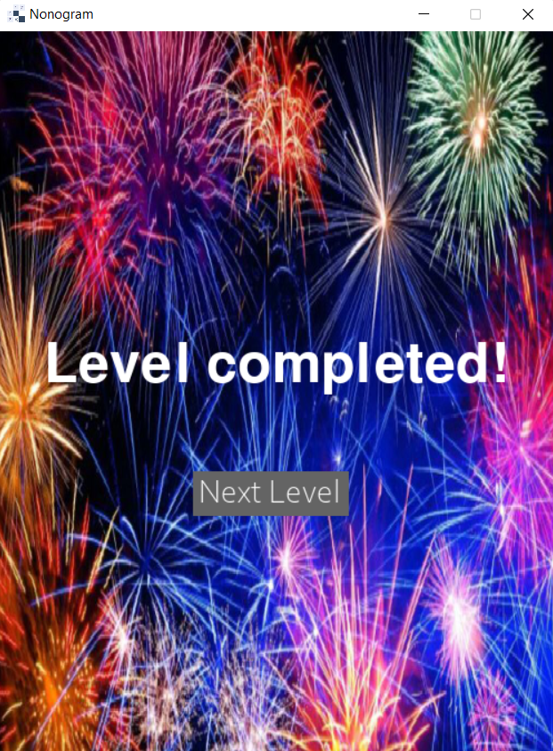
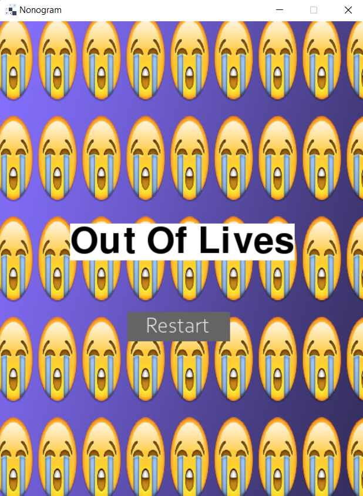

# nonogram

## Start the game:
python nonogram.py

## Game Snapshots:
### Snapshot 1 - Start screen:

### Snapshot 2 - Playing screen:

### Snapshot 1 - Winning screen:

### Snapshot 1 - Losing screen:

